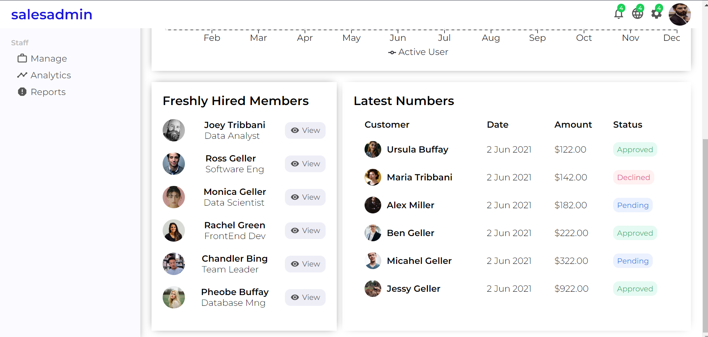

## Admin-Dashboard For Sales Administrator Using ReactJs

TechStack
- HTML
- CSS
- ReactJs
- Material UI

## Sales-Admin Dashboard
* A sales admin dashboard user interface is a tool that provides a visual representation of sales data and provide insights to help the sales administrators manage and track  the sales activities effectively.
* The dashboard allows sales administrator to monitor the sales performance in real-time. They can view key metrics such as total sales, revenue, customer acquisition rates, and sales growth trends. This helps them identify areas of success and areas that need improvement.
* The dashboard presents the sales data in a visually appealing and easy-to-understand manner. It uses charts, graphs, and other visual elements to represent complex sales information, making it easier for administrators to get trends, patterns, and outliers quickly.

Click on the Below Given Link to get the Preview Of The App

#### Home Page

 

### Users Page

 

